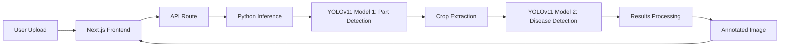

# 🍓 Strawberry Disease Detection System

<div align="center">

**A full-stack AI-powered web application for detecting diseases in strawberry plants using YOLOv11**

[](https://www.typescriptlang.org/)
[](https://nextjs.org/)
[](https://www.python.org/)
[](https://github.com/ultralytics/ultralytics)
[](https://tailwindcss.com/)

[Features](#-features) • [Demo](#-demo) • [Tech Stack](#-tech-stack) • [Installation](#-installation) • [Usage](#-usage) • [Architecture](#-architecture)

</div>

---

## 🌟 Features

### 🎯 Advanced Disease Detection
- **Multi-Model Architecture**:  Dual-stage detection system combining strawberry part detection and disease classification
- **7+ Disease Classes**: Detects multiple strawberry diseases including leaf blight and other common pathologies
- **High Accuracy**: YOLOv11 models trained on A100 GPUs with custom dataset augmentation
- **Real-time Processing**: Fast inference with confidence scoring and bounding box visualization

### 🖥️ Modern Web Interface
- **Responsive Design**: Built with Next.js 14 and TailwindCSS for seamless experience across devices
- **Interactive UI**: Upload images, select models, and view results with intuitive interface
- **Model Selection**: Choose between different detection strategies (part-first vs. direct detection)
- **Visual Results**: Annotated images with disease classifications and confidence scores

### 🔬 ML Pipeline Features
- **Data Augmentation**: HSV adjustments, lighting simulation for indoor farming conditions
- **Dataset Integration**: Automated tools for combining and normalizing multiple YOLO datasets
- **Training Scripts**: Optimized for A100 GPU with configurable hyperparameters
- **Model Versioning**: Multiple model variants for different use cases

---

## 🎬 Demo

### Web Application Interface
The application provides an intuitive interface for uploading strawberry images and receiving instant disease detection results:

1. **Upload Image** - Drag & drop or select JPEG/PNG images
2. **Select Models** - Choose between different detection models: 
   - Strawberry Part Detection v2
   - Best 7 Diseases Detection
   - Leaf Blight Detection
3. **Detection Method** - Part-first detection or direct disease detection
4. **View Results** - Annotated images with disease classifications, confidence scores, and bounding boxes

---

## 🛠️ Tech Stack

### Frontend
- **Framework**: [Next.js 14](https://nextjs.org/) (App Router)
- **Language**: TypeScript
- **Styling**: TailwindCSS + shadcn/ui components
- **UI Components**: Radix UI primitives
- **Icons**: Lucide React

### Backend & ML
- **API**: Next.js API Routes
- **ML Framework**: [Ultralytics YOLOv11](https://github.com/ultralytics/ultralytics)
- **Image Processing**: Sharp, OpenCV (cv2)
- **Python Runtime**: Spawn child processes for inference
- **Model Format**: PyTorch (. pt)

### DevOps & Tools
- **Version Control**: Git + Git LFS (for model files)
- **Package Manager**: npm
- **Linting**: ESLint
- **Code Formatting**: Prettier (via Tailwind)

---

## 📦 Installation

### Prerequisites
```bash
# Required software
- Node.js 18+ 
- Python 3.8+
- Git LFS
```

### Clone Repository

```bash
# Initialize Git LFS
git lfs install

# Clone the repository
git clone https://github.com/farreladriann/strawberry.git

# Navigate to project directory
cd strawberry

# Pull LFS files (model weights)
git lfs pull
```

### Install Dependencies

#### Python Dependencies
```bash
pip install -r requirements.txt
```

**requirements.txt** includes: 
- ultralytics (YOLOv11)
- opencv-python
- numpy
- Pillow

#### Node.js Dependencies
```bash
cd WebApp
npm install
```

### Model Setup
Ensure model files are in place (automatically pulled via Git LFS):
```
WebApp/models/
├── strawberry_tuned. pt
├── strawberry_part_detection. pt
├── best_strawberry_disease_model.pt
└── leafblight. pt
```

---

## 🚀 Usage

### Development Mode

```bash
cd WebApp
npm run dev
```

Open [http://localhost:3000](http://localhost:3000) in your browser. 

### Production Build

```bash
npm run build
npm start
```

### Using the Application

1. **Upload Image**:  Click the upload area or drag & drop a strawberry image
2. **Configure Detection**:
   - Choose detection method (Part-first or Direct)
   - Select part detection model
   - Select disease detection model
3. **Process**: Click "Detect Disease" button
4. **View Results**: 
   - Original vs. Processed image comparison
   - Detected diseases with confidence scores
   - Bounding boxes on affected areas
   - Download processed images

---

## 🏗️ Architecture

```
strawberry/
├── WebApp/                          # Next.js Frontend
│   ├── src/
│   │   ├── app/
│   │   │   ├── page.tsx            # Main application page
│   │   │   ├── layout.tsx          # Root layout
│   │   │   └── globals.css         # Global styles
│   │   ├── components/
│   │   │   └── ui/                 # shadcn/ui components
│   │   └── pages/
│   │       └── api/
│   │           ├── process-image.ts       # Original API endpoint
│   │           └── process-image-new.ts   # Enhanced API endpoint
│   ├── models/                      # YOLO model weights (. pt files)
│   ├── public/                      # Static assets
│   └── package.json
│
├── model_training/                  # ML Training Pipeline
│   ├── data_integration_cleaning/   # Dataset preparation
│   ├── data_augmentation/          # Image augmentation tools
│   └── dataset_prediction_train/   # Training scripts
│
└── requirements.txt                # Python dependencies
```

### Data Flow



---

## 🧠 Model Training

### Dataset Pipeline
Located in `model_training/`:

1. **Data Integration** (`data_integration_cleaning/`)
   - Combines multiple YOLO datasets
   - Class mapping and normalization
   - Distribution analysis

2. **Data Augmentation** (`data_augmentation/`)
   - HSV color space adjustments
   - Indoor farming lighting simulation
   - Advanced augmentation techniques

3. **Training** (`dataset_prediction_train/`)
   - YOLOv11 configuration
   - A100 GPU optimization
   - Hyperparameter tuning

### Training Configuration
- **GPU**:  NVIDIA A100
- **Framework**:  Ultralytics YOLOv11
- **Input Size**:  Configurable (typically 640x640)
- **Augmentation**: Extensive (HSV, rotation, scaling)

---

## 🎯 Detection Methods

### 1. Part-First Detection (Two-Stage)
1.  Detect strawberry parts/regions using part detection model
2. Crop detected regions
3. Run disease detection on cropped images
4. Aggregate results with confidence scores

**Best for**: Precision detection on complex images with multiple strawberries

### 2. Direct Detection (Single-Stage)
1. Apply disease detection model directly to entire image
2. Detect diseases and localize simultaneously

**Best for**:  Faster inference on images with clear strawberry visibility

---

## 📄 License

This project is available for portfolio and educational purposes.

---

## 👨‍💻 Author

**Farrel Adrian**

- GitHub: [@farreladriann](https://github.com/farreladriann)
- Project Link: [https://github.com/farreladriann/strawberry](https://github.com/farreladriann/strawberry)

---

<div align="center">

**⭐ Star this repository if you find it helpful!**

Made with ❤️ and 🍓

</div>
